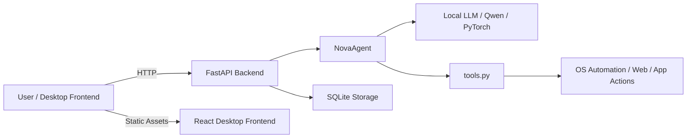

<p align="center">
  
</p>

# Nova — Local Desktop AI Assistant

Nova is a production-oriented local AI assistant designed for Windows desktop workflows. It combines a Python backend, local small language models, system-level automation tools, and a desktop-oriented UI architecture to deliver an autonomous assistant that can interact with local apps, browser windows, and external data sources.

## Overview

Nova is architected as a local agent platform that:
- hosts a FastAPI backend,
- orchestrates local model inference,
- executes OS-level automation via Python tooling,
- supports rich chat and task workflows,
- persists sessions and memory locally with SQLite.

The repository includes both the backend service and a packaged desktop frontend, enabling a seamless local assistant experience without reliance on cloud-based model serving.

## Features

- Local chat orchestration with session persistence
- Streaming assistant responses via FastAPI
- System telemetry and health checks
- Web search and page scraping
- Image and news retrieval
- OS automation:
  - terminal command execution
  - Notepad typing
  - Spotify playback
  - Discord messaging
  - Gmail drafting and send automation
- Local SQLite session storage
- React frontend served from the backend, packaged for desktop delivery

## Architecture Flow



Simplified ASCII flow:

- User interacts with frontend
- Frontend sends chat prompts to FastAPI
- FastAPI instantiates or resumes `NovaAgent`
- `NovaAgent` streams response back
- `tools.py` provides local OS automation capabilities
- Session history and memory persist in SQLite

## Tech Stack

- Python 3.x
- FastAPI
- Uvicorn
- SQLite
- React / Vite frontend
- Local small language models via PyTorch
- CustomTkinter UI (desktop-native assistant layer)
- System automation libraries:
  - `pyautogui`
  - `subprocess`
  - `webbrowser`
  - `requests`
  - `BeautifulSoup`
  - `psutil`
  - `GPUtil`
- Desktop packaging support via Electron-style distribution

## Folder Structure

- `server.py` — main FastAPI backend, session persistence, API endpoints, frontend hosting
- `tools.py` — OS automation and assistant actuator functions
- `agent.py` — local agent orchestration and model interaction
- `nova-frontend/` — React application for the desktop UI
  - `src/` — React source code
  - `public/` — static resources
  - `release/` — packaged desktop build artifacts
- `nova_chats.db` — local SQLite database created at runtime

Example tree:

- `c:\Users\yatha\Documents\NovaAI`
  - `server.py`
  - `tools.py`
  - `agent.py`
  - `nova-frontend/`
    - `src/`
      - `App.tsx`
      - `main.tsx`
      - `components/`
    - `public/`
    - `release/`

## Setup

1. Clone the repository
2. Create a Python virtual environment
3. Install backend dependencies

```powershell
cd c:\Users\yatha\Documents\NovaAI
python -m venv .venv
.\.venv\Scripts\Activate.ps1
python -m pip install --upgrade pip
python -m pip install fastapi uvicorn ddgs requests beautifulsoup4 psutil gputil pyautogui
```

4. Install frontend dependencies

```powershell
cd nova-frontend
npm install
```

## Usage

### Run Backend

From the repo root:

```powershell
cd c:\Users\yatha\Documents\NovaAI
.\.venv\Scripts\Activate.ps1
python server.py
```

The server listens on `http://0.0.0.0:8000` and serves both API routes and the frontend.

### Run Frontend in Development

```powershell
cd nova-frontend
npm run dev
```

### Build Frontend

```powershell
cd nova-frontend
npm run build
```

### Desktop Packaging

The repository includes packaged desktop assets under `nova-frontend/release/`. Use this folder for deployment-ready Electron-style desktop delivery.

## Important Notes

- The backend uses local storage and local models whenever possible.
- The assistant can perform direct desktop automation; use carefully during development.
- Session history and memory are persisted in `nova_chats.db`.

## Privacy & Deployment

This repository is designed for local-first deployment. Core production deployment configurations, environment secrets, and model keys are managed in a private environment and are not included in the public repository.
